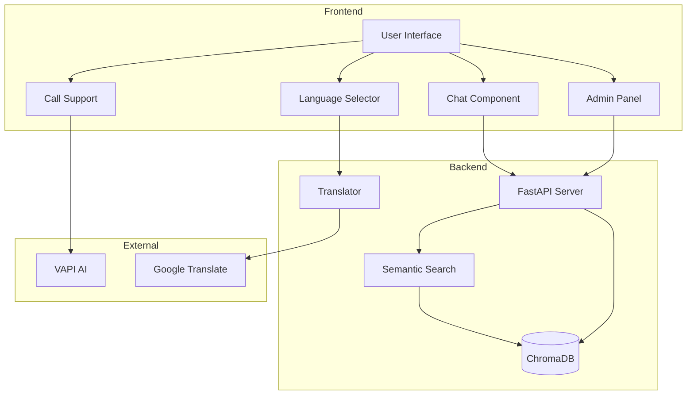
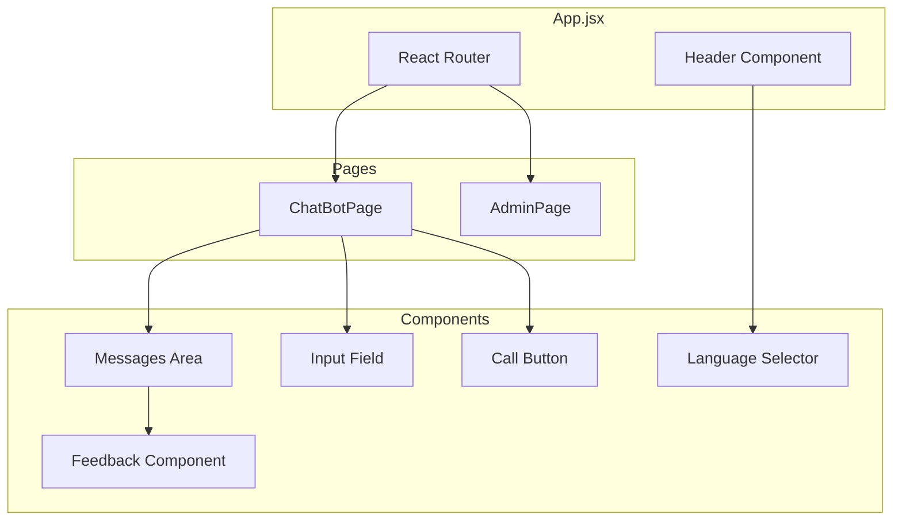
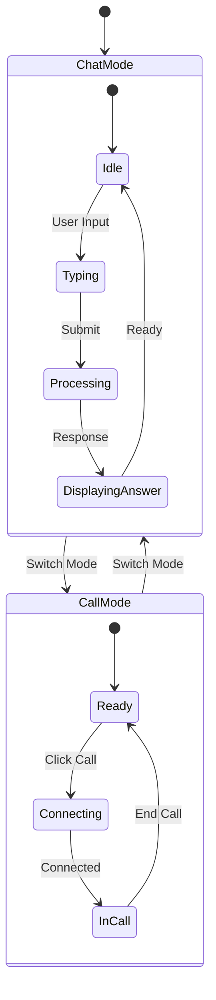

# Philips FAQ Bot

An AI-powered FAQ chatbot for Philips customer support, built with sentence-transformers for semantic search.

## System Architecture



## Features

- Dynamic chatbot interface for querying Philips FAQs
- Multi-language support (English and Hindi)
- User feedback system
- Admin interface for adding new FAQs
- Vector-based semantic search using ChromaDB
- Local embeddings using sentence-transformers (no OpenAI API required)
- Google Translate integration for Hindi support
- Real-time video call support integration with VAPI AI

## Tech Stack

### Frontend:
- React + Vite
- Material UI
- React Router
- Axios

### Backend:
- FastAPI
- sentence-transformers
- ChromaDB vector database
- googletrans
- Python-dotenv

## Prerequisites

- Python 3.9 or higher
- Node.js 16 or higher
- npm or yarn

## Setup

1. Clone the repository:
   ```bash
   git clone <repository-url>
   cd philips-faq-bot
   ```

2. Set up the backend:
   ```bash
   cd backend
   
   # Create a virtual environment (recommended)
   python -m venv venv
   source venv/bin/activate  # On Windows: venv\Scripts\activate
   
   # Install dependencies
   pip install -r requirements.txt
   ```

3. Set up the frontend:
   ```bash
   cd frontend
   npm install
   ```

## Running the Application

1. Start the backend server:
   ```bash
   cd backend
   
   # Activate virtual environment if you created one
   source venv/bin/activate  # On Windows: venv\Scripts\activate
   
   # Start the server
   uvicorn app:app --reload --port 8000
   ```
   Note: On first run, it will download the sentence-transformers model (about 90MB)

2. Start the frontend development server (in a new terminal):
   ```bash
   cd frontend
   npm run dev
   ```

3. Access the application:
   - Frontend: http://localhost:3000
   - Backend API: http://localhost:8000
   - Admin interface: http://localhost:3000/admin (password: admin123)

## Usage

1. Chat Interface:
   - Open http://localhost:3000
   - Select language (English/हिंदी) from the top bar
   - Type your question about Philips products or services
   - Get instant answers from the FAQ database
   - Provide feedback using thumbs up/down

2. Call Support:
   - Click the mode selector in the top bar
   - Choose "Call Support"
   - Click the green call button to initiate a video call
   - Interact with the AI support agent through VAPI

3. Admin Interface:
   - Open http://localhost:3000/admin
   - Login with password: admin123
   - Add new FAQs through the form
   - New FAQs are immediately available for searching

## Features in Detail

1. Semantic Search:
   - Uses sentence-transformers for generating embeddings locally
   - ChromaDB for efficient vector similarity search
   - Fallback to text matching when needed

2. Multi-language Support:
   - English and Hindi language support
   - Real-time translation using Google Translate
   - Language can be changed anytime during conversation

3. Admin Features:
   - Secure admin interface
   - Add new FAQs easily
   - FAQs are stored both in vector database and JSON file

4. User Experience:
   - Modern, responsive UI
   - Real-time chat experience
   - Feedback system for continuous improvement

## Component Structure



## State Management



## Troubleshooting

1. If port 8000 is in use:
   ```bash
   # Kill existing process and restart
   pkill -f uvicorn
   cd backend && uvicorn app:app --reload --port 8000
   ```

2. If the frontend can't connect to backend:
   - Ensure backend is running on port 8000
   - Check CORS settings in backend/app.py
   - Verify API endpoint URLs in frontend code

3. For translation issues:
   - Ensure internet connectivity for Google Translate
   - Check console for any translation errors 

Customer Service Related:
"Where is the nearest Philips customer service center?"
"How can I contact Philips customer support?"
"What are Philips customer service hours?"
Product Related:
"How do I register my new Philips product?"
"What is the warranty period for Philips air purifiers?"
"How can I get my Philips product repaired?"
"Tell me about Philips kitchen appliances"
Healthcare Equipment:
"What healthcare equipment does Philips make?"
"What are Philips' latest innovations in healthcare?"
"How can I purchase Philips medical equipment?"
Company Information:
"What is Philips' mission?"
"Tell me about Philips' history"
"What are Philips' core values?"
Personal Care Products:
"What personal care products does Philips offer?"
"How do I maintain my Philips grooming products?"
"Where can I buy Philips personal care products?"
Specific Product Categories:
"Tell me about Philips air purifiers"
"What features do Philips kitchen appliances have?"
"Which Philips products are best for home use?"
Y